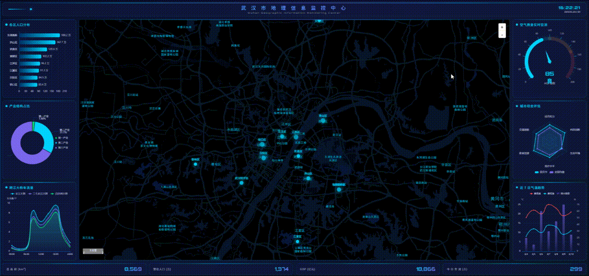

# 城市地理信息监控中心

基于 Vue 3 + ECharts + 高德地图的智慧城市数据可视化大屏。

## 技术栈

- **前端框架**: Vue 3 (Composition API)
- **图表库**: ECharts 5.5
- **地图服务**: 高德地图 JS API 2.0
- **构建工具**: Vite 6.2

## 项目结构

```
src/
├── components/
│   ├── AMapView.vue        # 高德地图组件
│   ├── BarChart.vue        # 柱状图
│   ├── BaseChart.vue       # 图表基础组件
│   ├── DigitalHeader.vue   # 数字化标题栏
│   ├── GaugeChart.vue      # 仪表盘
│   ├── LineChart.vue       # 折线图
│   ├── NumberRoll.vue      # 数字滚动组件
│   ├── PieChart.vue        # 饼图
│   ├── RadarChart.vue      # 雷达图
│   └── WeatherChart.vue    # 天气图表
├── assets/styles/
│   └── global.css          # 全局样式
├── App.vue                 # 主应用组件
└── main.js                # 入口文件
```

## 功能特性

- 🗺️ **交互式地图** - 高德地图展示武汉市地理信息
- 📊 **多维数据可视化** - 柱状图、饼图、折线图、雷达图、仪表盘
- 🎯 **实时数据展示** - 数字滚动动画效果
- 🌐 **响应式布局** - 适配不同屏幕尺寸
- 💫 **炫酷动画** - 流畅的过渡和交互动画

## 快速开始

### 安装依赖

```bash
npm install
```

### 开发模式

```bash
npm run dev
```

### 生产构建

```bash
npm run build
```

### 预览构建结果

```bash
npm run preview
```

## 环境变量

在项目根目录创建 `.env` 文件：

```env
VITE_AMAP_KEY=你的高德地图Key
VITE_AMAP_SECURITY_CODE=你的安全密钥
```

## 页面布局

```
┌──────────────────────────────────────────┐
│           标题栏 (DigitalHeader)          │
├────────┬──────────────────┬──────────────┤
│ 左面板  │   高德地图        │  右面板      │
│ 人口    │   (AMapView)     │  AQI        │
│ GDP     │                  │  城市评估    │
│ 产业    │                  │  天气        │
├────────┴──────────────────┴──────────────┤
│         底部统计栏 (NumberRoll)           │
└──────────────────────────────────────────┘
```

## 浏览器支持

- Chrome >= 90
- Firefox >= 88
- Safari >= 14
- Edge >= 90

## 许可证

MIT License